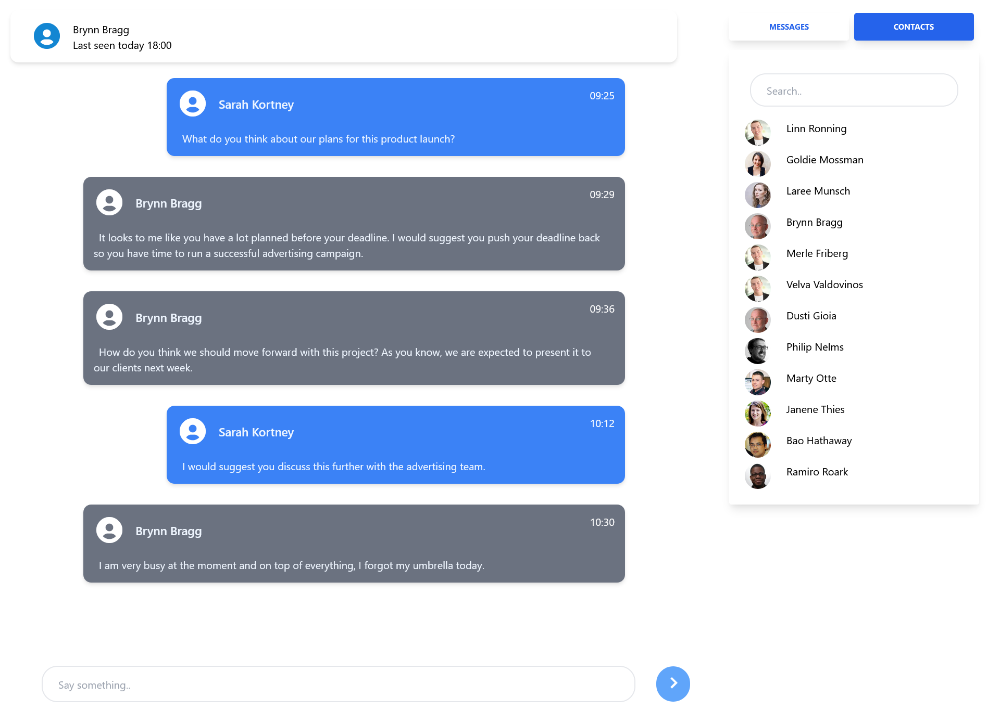

# chat-nuxt



## Setup

```bash
# install dependencies
$ yarn install

# serve with hot reload at localhost:3000
$ yarn dev


For detailed explanation on how things work, check out the [documentation](https://nuxtjs.org).

